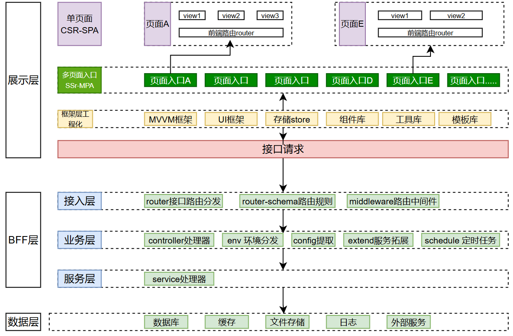
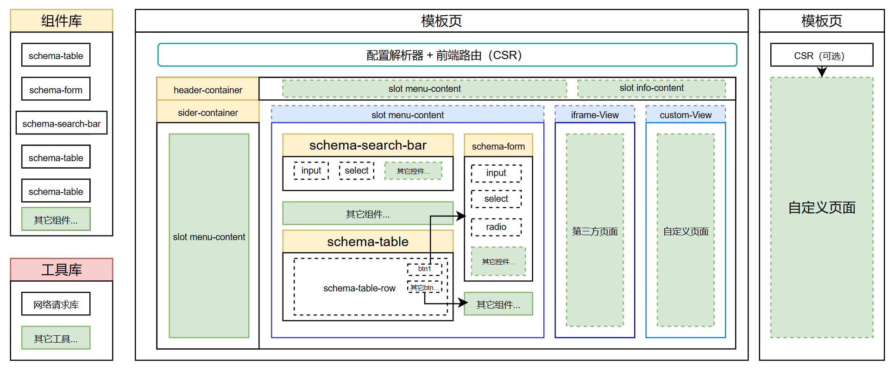

## 前言

年初买了哲哥(dy“哲玄前端”)的《大前端全栈实践》课程，最近终于有时间学完了，收获满满，写一遍文章来复习总结一下，也希望能把哲哥的一些思考分享给大家。

从哲哥的第一节课就觉得他很用心、干货满满，后面他出的课程我都有学习，我还是比较少的知识付费，但仍推荐大家学习一下哲哥的课，他不仅仅教你做一个什么东西，更多的是在过程中教你如何思考，如何设计，如何去搭建架构。

这个课程是从 0 到 1 搭建一个全栈的企业级框架实践，旨在抽离后台 CRUD80%的重复工作，通过 schema 配置化实现业务开发，该系统分成 5 个里程碑阶段实现，最终封装全栈框架发布 NPM。

## 准备

### 背景

在大量的中后台系统中，我们会遇到很多重复的 CRUD 操作，而这些操作都有相似的模式，只是数据不同。当下的常见的解决办法有低代码平台，但是低代码平台的功能还是比较有限的，拓展性也不是很好，很难去满足复杂的业务需求。而 Elpis 从数据出发，通过 schema 配置化实现业务开发，从而抽离后台 CRUD80%的重复工作，剩下的 20%工作可通过拓展组件实现。

### 架构设计

Elpis 框架分成数据层、BFF 层、展示层。



#### 数据层

数据层主要包含数据库、缓存、文件存储、日志、外部服务等

#### BFF 层

BFF 层主要包含路由、业务逻辑、数据访问等，它的作用是将前端请求路由到对应的业务逻辑，同时也负责与数据层进行交互。

#### 展示层

展示层主要包含前端页面、组件库、样式框架等，它的作用是将业务逻辑展示给用户，同时也负责与用户进行交互。

### 概念

#### JSON-Schema

**JSON Schema** 是一种用于描述和验证 JSON 数据结构的规范。它提供了一种标准化的方法来定义 JSON 数据的格式、类型、约束和关系。开发中，几乎离不开对象，它是一个很重要的数据结构，而我们每个人也许描述都不一样，这往往加大了交互的难度，而 JSON-Schema 规范约定我们如何去描述，去验证和交互。

比如我们如何去描述以下的数据：

```json
{
  "postOfficeBox": "123",
  "streetAddress": "456 Main St",
  "locality": "Cityville",
  "region": "State",
  "postalCode": "12345",
  "countryName": "Country"
}
```

基本的示例：

```json
{
  "$id": "https://example.com/address.schema.json",
  "$schema": "https://json-schema.org/draft/2020-12/schema",
  "description": "An address similar to http://microformats.org/wiki/h-card",
  "type": "object",
  "properties": {
    "postOfficeBox": {
      "type": "string"
    },
    "extendedAddress": {
      "type": "string"
    },
    "streetAddress": {
      "type": "string"
    },
    "locality": {
      "type": "string"
    },
    "region": {
      "type": "string"
    },
    "postalCode": {
      "type": "string"
    },
    "countryName": {
      "type": "string"
    }
  },
  "required": ["locality", "region", "countryName"],
  "dependentRequired": {
    "postOfficeBox": ["streetAddress"],
    "extendedAddress": ["streetAddress"]
  }
}
```

通过这份 JSON-schema 便可以很清晰地看懂一个对象，一份数据.

而我们也可以很容易通过 JSON-Schema 去描述一个系统长什么样，有什么菜单，菜单里面有什么数据，数据长什么样等等，我们也就可以基于这份配置去设计、搭建我们的框架。

## 里程碑一：基于 Node.js+Koa 实现一个服务端开发框架

服务端应用目录结构图如下

```
├─ app
│  ├─ controller
│  ├─ extend
│  ├─ middleware
│  ├─ middleware.js
│  ├─ public
│  ├─ router
│  ├─ router-schema
│  └─ service
├─ config
├─ elpis-core
│  ├─ index.js
│  ├─ env.js
│  ├─ loader
│  │  ├─ config.js
│  │  ├─ controller.js
│  │  ├─ extend.js
│  │  ├─ middleware.js
│  │  ├─ router-schema.js
│  │  ├─ router.js
│  │  ├─ service.js
```

服务端通过 loader 加载配置、中间件、服务、控制器、路由配置、拓展等，运行时通过 router 将请求路由到对应的控制器。各个 loader 会自动检索 app 目录下的文件，将符合要求的文件加载到应用中，比如 controller 目录下的文件会被加载为控制器，无需手动注册。

#### config

config 目录下的文件会被加载为应用的配置，比如数据库连接配置、缓存配置、日志配置等。

#### extend

extend 目录下的文件会被加载为应用的扩展，比如日志扩展等。

#### middleware

middleware 目录下的文件会被加载为应用的中间件，比如权限中间件等。

#### router

router 目录下的文件会被加载为应用的路由，每个文件对应一个路由，文件名就是路由的名称，文件内容就是路由的代码。路由负责将请求路由到对应的控制器。

#### router-schema

router-schema 目录下的文件会被加载为应用的路由配置，用于校验请求参数是否符合要求。

#### controller

controller 目录下的文件会被加载为应用的控制器，每个文件对应一个控制器，文件名就是控制器的名称，文件内容就是控制器的代码。控制器负责处理请求，调用服务层的方法，返回响应。

#### service

service 目录下的文件会被加载为应用的服务，每个文件对应一个服务，文件名就是服务的名称，文件内容就是服务的代码。服务负责处理业务逻辑，调用数据层的方法，返回结果。

## 里程碑二：基于 webpack5+Express 完成前端工程化建设

前端工程化建设是一个很重要的环节，大家都知道浏览器是只认识 HTML、CSS、JS 这三种语言，而我们在开发中通常会使用到很多其他的语言，比如 Vue、React、TypeScript 等，这些语言都需要通过编译成浏览器认识的语言才能运行。
webpack、vite 等工具的核心就是，从入口文件开始，分析依赖，通过各种 loader 将依赖的文件编译成浏览器认识的语言，同时也会在各个打包周期中，比如打包前、打包中、打包后等，通过 plugin 插件的方式，对打包后的文件进行处理，比如压缩、优化等。同时我们也可以配置一些路径别名、环境变量等，方便我们在开发中使用。

我们将 webpack 配置分成三份，分别是公共配置、开发环境配置、生产环境配置。
公共配置包含了所有环境都需要的配置，比如入口文件、输出路径、插件等。
开发环境配置包含了开发时需要的配置，比如热更新、source-map 等。
生产环境配置包含了生产时需要的配置，比如压缩、优化等。

#### MPA

对于 MPA 应用，需要多入口，我们可以借助 NodeJS 的 glob 模块，按照约定好的格式去检索 app 目录下的所有入口文件，然后将这些文件作为入口文件，打包成多个 bundle。

#### 热更新

通过 Express 启动开发服务器，集成 webpack-dev-middleware 与 webpack-hot-middleware，实现热更新与静态资源托管。核心流程：

1. 读取开发配置 `webpack.dev.js` 导出的 `webpackConfig` 与 `DEV_SERVER_CONFIG`；
2. 实例化 Express，以 `webpack` 编译器创建中间件；
3. 将构建产物目录 `./app/public/dist` 作为静态资源托管；
4. `devMiddleware` 负责监听文件变化，触发重新构建；
5. `hotMiddleware` 监听 `HMR_PATH` 实现模块热替换；

```js
const express = require("express");
const path = require("path");
const consoler = require("consoler");
const webpack = require("webpack");
const devMiddleware = require("webpack-dev-middleware");
const hotMiddleware = require("webpack-hot-middleware");
module.exports = () => {
  const {
    webpackConfig,
    DEV_SERVER_CONFIG,
  } = require("./config/webpack.dev.js");

  const app = express();
  const compiler = webpack(webpackConfig);
  // 指定静态文件目录
  app.use(express.static(path.join(process.cwd(), "./app/public/dist")));
  //引用devMiddlewarez中间件（监控文件改动）
  app.use(
    devMiddleware(compiler, {
      //落地文件
      writeToDisk: (filePath) => filePath.endsWith(".tpl"),
      //资源路径
      publicPath: webpackConfig.output.publicPath,
      //headers配置
      headers: {
        "Access-Control-Allow-Origin": "*",
        "Access-Control-Allow-Headers":
          "X-Requested-With,Content-Type,Authorization",
        "Access-Control-Allow-Methods": "PUT,POST,GET,DELETE,OPTIONS",
      },
      stats: {
        colors: true,
      },
    })
  );
  //引用hotMiddleware中间件（热更新）
  app.use(
    hotMiddleware(compiler, {
      path: `/${DEV_SERVER_CONFIG.HMR_PATH}`,
      log: () => {},
    })
  );
  consoler.info("请等待webpack初次构建完成提示...");
  //启动服务devServer
  const port = DEV_SERVER_CONFIG.PORT;
  app.listen(port, () => {
    console.log(`app listening on port${port}`);
  });
};
```

## 里程碑三：基于领域模型方案完成系统架构设计

这点是该课程重中之重，我们需要根据业务场景，设计出合理的领域模型，提高系统的可维护性与可扩展性。

一个后台管理系统，基本都是几个元素组成：header、sider、content、footer，
其中 header 包含了系统的 logo、导航菜单、用户信息等；
sider 包含了系统的导航菜单；
content 包含了系统的主要内容区域，常见的是 iframe、表格、表单、图表。
footer 包含了系统的版权信息等。
再加上一个 layout 组件，将这几个元素组合起来，形成一个完整的页面。

那么我们可以将以上元素抽象出来，根据业务场景和数据，通过 schema 去描绘整个系统的要素和各种数据，动态渲染出不同的页面。

系统架构设计:



根据以上的系统架构设计我们可以抽象出来一个电商系统的 model 配置:

```js
module.exports = {
  //模板类型，不同模板类型对应不一样的模板数据结构
  mode: "dashboard",
  //模板名称
  name: "电商系统",
  menu: [
    {
      key: "product", //菜单项的唯一标识
      name: "商品管理", //菜单项的名称
      menuType: "module", //枚举值：group/module
      moduleType: "schema", //枚举值：schema/custom
      //当menuType为group时可填
      schemaConfig: {
        api: "/api/proj/product",
        schema: {
          type: "object",
          required: ["product_name"],
          properties: {
            product_id: {
              type: "string",
              label: "商品ID",
              searchOption: {
                comType: "input", //配置组件类型 input/select/checkbox/radio/datePicker
                default: "", //默认值
                //comType ==='select'时
              },
              tableOption: {
                width: 300,
                "show-overflow-tooltip": true,
              },
              detailPanelOption: {},
            },
            product_name: {
              type: "string",
              label: "商品名称",
              minLength: 10,
              tableOption: {},
              searchOption: {
                comType: "input", //配置组件类型 input/select/checkbox/radio/datePicker
                default: "", //默认值
                //comType ==='select'时
              },
              createFormOption: {
                comType: "input", //配置组件类型 input/select/checkbox/radio/datePicker
                default: "", //默认值
                placeholder: "请输入商品名称",
                //comType ==='select'时
              },
              editFormOption: {
                comType: "input", //配置组件类型 input/select/checkbox/radio/datePicker
                default: "", //默认值
                //comType ==='select'时
              },
              detailPanelOption: {},
            },
            price: {
              type: "number",
              label: "商品价格",
              tableOption: {
                width: 200,
              },
              createFormOption: {
                comType: "inputNumber", //配置组件类型 input/select/checkbox/radio/datePicker
                default: "", //默认值
                type: "number",
                //comType ==='select'时
              },
              editFormOption: {
                comType: "inputNumber", //配置组件类型 input/select/checkbox/radio/datePicker
                default: "", //默认值
                type: "number",
                //comType ==='select'时
              },
              detailPanelOption: {},
            },
            inventory: {
              type: "number",
              label: "库存",
              tableOption: {
                width: 200,
              },
              createFormOption: {
                comType: "select", //配置组件类型 input/select/checkbox/radio/datePicker
                default: "", //默认值
                //comType ==='select'时
                enumList: [
                  {
                    label: "100",
                    value: 100,
                  },
                ],
              },
              editFormOption: {
                comType: "select", //配置组件类型 input/select/checkbox/radio/datePicker
                default: "", //默认值
                //comType ==='select'时
                enumList: [
                  {
                    label: "100",
                    value: 100,
                  },
                ],
              },
              detailPanelOption: {},
            },
            create_time: {
              type: "string",
              label: "创建时间",
              tableOption: {
                width: 200,
              },
              detailPanelOption: {},
            },
          },
        },
      },
      tableConfig: {
        headerButtons: [
          {
            label: "新增",
            type: "primary",
            plain: true,
            eventKey: "showComponent", //按钮事件名
            eventOption: {
              comName: "createForm", //组件名称
            },
          },
        ],
        rowButtons: [
          {
            label: "修改",
            type: "warning",
            eventKey: "showComponent",
            eventOption: {
              comName: "editForm", //组件名称
            },
          },
          {
            label: "删除",
            type: "danger",
            eventKey: "remove",
            eventOption: {
              params: {
                product_id: "schema::product_id",
              },
            },
          },
          {
            label: "详情",
            type: "info",
            eventKey: "showComponent",
            eventOption: {
              comName: "detailPanel", //组件名称
            },
          },
        ],
      },
      componentConfig: {
        createForm: {
          title: "新增商品",
        },
        editForm: {
          mainKey: "product_id",
          title: "修改商品",
        },
        detailPanel: {
          mainKey: "product_id",
          title: "商品详情",
        },
      },
    },
    {
      key: "order", //菜单项的唯一标识
      name: "订单管理", //菜单项的名称
      menuType: "module", //枚举值：group/module
      moduleType: "custom",
      //当menuType为group时可填
      customConfig: {
        path: "/todo",
      },
    },
    {
      key: "client", //菜单项的唯一标识
      name: "客户管理", //菜单项的名称
      menuType: "module", //枚举值：group/module
      moduleType: "custom",
      //当menuType为group时可填
      customConfig: {
        path: "/todo",
      },
    },
  ],
};
```

我们可以通过这份配置自动化搭建系统中的页面元素，80%的工作量可以通过我们沉淀下来的组件完成，剩下的 20%工作量主要是根据业务场景，定制化开发一些组件或页面，以满足业务需求。

## 里程碑四：基于 Vue3+ElementPlus 实现前端动态组件

上一个里程碑我们实现了系统的架构设计，而现在我们要做的是弹药库，我们会根据系统的需求，沉淀一些常用的组件，以便开发中重复使用。

我们可以定义一下常用组件，需要时直接在配置中引用即可，而一些定制化的组件，我们可以根据业务场景，在开发中单独定制，并注册到组件中心中提供使用。

如：

```json
import input from "./complex-view/input/input.vue";
import inputNumber from "./complex-view/input-number/input-number.vue";
import select from "./complex-view/select/select.vue";

// 拓展
import *** from './***'

const FormItemConfig = {
  input: {
    component: input,
  },
  inputNumber: {
    component: inputNumber,
  },
  select: {
    component: select,
  },
    // 拓展
    ***:{
     component: ***,
   }
};
export default { ...FormItemConfig };
```

引用时：

```
key:{
   comType: "inputNumber",
}

key:{
   comType: "select",
   options:[
     {label:'男'，value:'man'}
   ]
}

key:{
   comType: "***",
}
```

而实现是通过 component 动态组件实现的，根据 comType 动态切换组件。

```html
<component
  v-show="itemSchema.option.visible !== false"
  :is="ItemConfig[itemSchema.option?.comType]?.component"
  :schemaKey="key"
  :schema="itemSchema"
  :model="model ? model[key] : undefined"
  ref="formComList"
>
</component>
```

## 里程碑五：抽象封装成 Elpis 全栈框架并发布到线上 NPM 库

居然是一个框架，那我们就需要把它发布到线上 NPM 库，以便其他开发者使用。

### 准备

#### 运行环境

我们在开发库和库的引用是不同的运行环境。在使用库的代码中，前端 webpack 的时候，import 使用别名时是在运行环境，而库在使用 loader 时配置 path 需注意要用`require.resolve`保证使用当前库，不然会出现路径错误的问题。
如：

```js
// 库的 webpack 配置
module.exports = merge.smart(
  {
    module: {
      rules: [
        {
          test: /\.vue$/,
          loader: "vue-loader",
        }
      ]
    },
  }
```

以上代码中，如果在业务打包时， "vue-loader"会在业务代码中寻找，如果业务 package 中没有的话就会报错了，而我们本质是希望在库的 package 中寻找 "vue-loader"的，那么我们就需要用到 `require.resolve` 来确保使用当前库中的 "vue-loader"。

```js
// 库的 webpack 配置
module.exports = merge.smart(
  {
    module: {
      rules: [
        {
          test: /\.vue$/,
          loader: require.resolve("vue-loader"),
        }
      ]
    },
  }
```

除此之外，各种引用路径也许需要注意，如`process.cwd()`，它返回的是业务代码所在的目录，而在库的代码中，我们需要借助`__dirname`或相对路径来获取库的目录。

#### 区分库组件或业务组件

```js
import input from "./complex-view/input/input.vue";
import inputNumber from "./complex-view/input-number/input-number.vue";
import select from "./complex-view/select/select.vue";

const FormItemConfig = {
  input: {
    component: input,
  },
  inputNumber: {
    component: inputNumber,
  },
  select: {
    component: select,
  },
};

export default { ...FormItemConfig };
```

以上都是库沉淀的组件注册，那么如果业务场景有定制化的组件就无法注册了。因此需加上对业务组件的拓展

```js
import input from "./complex-view/input/input.vue";
import inputNumber from "./complex-view/input-number/input-number.vue";
import select from "./complex-view/select/select.vue";

//业务扩展form-item 配置
import BusinessFormItemConfig from "$businessFormItemConfig";
const FormItemConfig = {
  input: {
    component: input,
  },
  inputNumber: {
    component: inputNumber,
  },
  select: {
    component: select,
  },
};

export default { ...FormItemConfig, ...BusinessFormItemConfig };
```

`$businessFormItemConfig`便是业务场景下的定制化组件注册，在库中需对其进行合并，支持拓展。

#### 暴露启动入口

在库的入口文件中，我们需要暴露一些启动入口，如启动服务、前端工程化构建、服务端基础控制器类、服务端基础服务类等，供业务场景开发使用。

```js
// 引入 elpis-core
const ElpisCore = require("./elpis-core");
// 引入 前端工程化构建方法
const FEBuildDev = require("./app/webpack/dev.js");
// 引入 前端工程化构建方法
const FEBuildProd = require("./app/webpack/prod.js");

module.exports = {
  /**
   * 启动服务
   * @param {*} options 启动参数
   */
  serverStart: (options) => {
    const app = ElpisCore.start(options);
    return app;
  },
  /**
   * 前端工程化构建
   * @param {*} dev 构建环境
   */
  frontendBuild(dev) {
    if (dev === "local") {
      FEBuildDev();
    } else if (dev === "prod") {
      FEBuildProd();
    }
  },
  /**
   * 服务端基础控制器类
   */
  Controller: {
    Base: require("./app/controller/base.js"),
  },
  /**
   * 服务端基础服务类
   */
  Service: {
    Base: require("./app/service/base.js"),
  },
};
```

#### 提供提示支持

如果库的使用者对库不了解，那么基础的提示很有必要，要想库中的注释信息、类型等等得到 IDEA 的支持，

对于一些约定的路径别名，我们需要在 jsconfig.json/tsconfig.json 中配置并提供给业务 package 中的 jsconfig.json/tsconfig.json 拓展

```js
// 库中的 jsconfig.json/tsconfig.json 配置
{
  "compilerOptions": {
    "baseUrl": ".",
    "paths": {
      "$businessFormItemConfig": ["./app/config/business-form-item-config.js"],
    },
  },
}
// 业务场景下的 jsconfig.json/tsconfig.json 配置
{
  "extends": "@elpis/jsconfig.json",
  "compilerOptions": {
    "baseUrl": "."
  }
}

```

如果是库中暴露出去的方法等，我们则需要生成对应的类型声明文件，如.d.ts 文件，以便业务场景下的 IDEA 支持。然后在 package.json 中添加"types": "./dist/index.d.ts"，而对于有子路径的，我们还要 exports 或者 typesVersions 配置，指向子路径的 d.ts 文件,即可在业务场景下得到类型提示。

```js
{
  "name": "demo",
  "version": "1.0.0",
  "main": "dist/index.js",
  "types": "./dist/index.d.ts",
  "exports": {
    ".": {
      "types": "./dist/index.d.ts",
      "import": "./dist/index.js"
    },
    "./utils": {
      "types": "./dist/utils.d.ts",
      "import": "./dist/utils.js"
    }
  },
  "typesVersions": {
    "*": {
      "utils": ["dist/utils.d.ts"]
    }
  }
}
```

### 本地测试

在本地测试时，我们需要将库链接到业务场景中，以便在业务场景中使用库的代码。

```bash
# 进入库目录
cd elpis
# 链接库到业务场景中
npm link
# 进入业务场景目录
cd business-scene
# 链接库到业务场景中
npm link elpis
```

### 发布

发布前，需要在库目录下的 package.json 中配置好版本号、发布的 npm 包名、发布的 npm 包的描述等信息，而后每一次更新代码后，都需要更新 package.json 中的版本号，然后发布到 npm 上。

```bash
# 进入库目录
# 登录 npm 账号
npm login
# 进入库目录
cd elpis
# 发布库到 npm 上
npm publish
```

## 总结

整个课程从 0 到 1 去实现了一个全栈框架，除了项目本身，也有一些思想上的收获。

### “设计思想”开发习惯

我们在写代码的时候，需先设计好框架，再去实现过程。
比如我们写一个函数，需要先考虑好函数的参数、返回值、异常情况等，过程的注释，再去实现函数的逻辑。

```js
function fn(params) {
  let result = "";

  // 1.校验参数

  // 2.步骤1

  // 3.步骤2

  // 4.结果处理
  return result;
}
```

我们在设计好框架后，就可以根据框架去实现过程，这样可以使代码更加清晰、易维护。

### 组件设计

在设计组件时，我们需考虑面向对象，继承 baseOptions，开放拓展，支持定制化。理念是低耦合，可拓展。

如我们去实现一些 form 表单下面的输入组件，我们可以先抽象出一个 BaseOptions 基础类，封装所有组件的通用属性和方法，如是否可见、验证、取值等。同时尽量不要嵌套业务逻辑，除非你在做一个通用的业务组件。

## 拓展

也许这个系统无法直接搬到我们当下的工作项目中，但是我们也可以把里面小的模块拿出来，比如一个 CRUD 页面，我们也可以设计一个 DSL 来描述这个页面的结构，通过 schema 配置页面中的表格、表单、按钮等组件，实现一个可定制化的 CRUD 页面。无需上升到整个系统的架构层次，只需要考虑到页面的结构和组件的定制化即可，这在当下工作开发会更常用。

```js
// 管理页面的 DSL 配置
module.exports = {
  // API 配置
  apiConfig: {
    baseUrl: "/api/user",
    list: "/list", // 列表查询接口
    detail: "/:id", // 详情查询接口
    create: "/create", // 新增接口
    update: "/:id", // 更新接口
    delete: "/:id", // 删除接口
  },

  // 数据模型定义
  schema: {
    type: "object",
    required: ["username", "email", "role"],
    properties: {
      id: {
        type: "string",
        label: "用户ID",
        // 表格显示配置
        tableOption: {
          width: 100,
          fixed: "left",
          sortable: true,
        },
        // 搜索配置
        searchOption: {
          comType: "input",
          placeholder: "请输入用户ID",
        },
        // 详情面板配置
        detailOption: {
          visible: true,
          readonly: true,
        },
      },
      username: {
        type: "string",
        label: "用户名",
        minLength: 3,
        maxLength: 20,
        // 表格配置
        tableOption: {
          width: 150,
          "show-overflow-tooltip": true,
        },
        // 搜索配置
        searchOption: {
          comType: "input",
          placeholder: "请输入用户名",
        },
        // 新增表单配置
        createFormOption: {
          comType: "input",
          placeholder: "请输入用户名",
          rules: [
            { required: true, message: "用户名不能为空" },
            { min: 3, max: 20, message: "用户名长度在3-20个字符" },
          ],
        },
        // 编辑表单配置
        editFormOption: {
          comType: "input",
          placeholder: "请输入用户名",
          disabled: true, // 编辑时用户名不可修改
        },
        // 详情面板配置
        detailOption: {
          visible: true,
        },
      },
      email: {
        type: "string",
        label: "邮箱",
        format: "email",
        tableOption: {
          width: 200,
        },
        searchOption: {
          comType: "input",
          placeholder: "请输入邮箱",
        },
        createFormOption: {
          comType: "input",
          placeholder: "请输入邮箱地址",
          rules: [
            { required: true, message: "邮箱不能为空" },
            { type: "email", message: "请输入正确的邮箱格式" },
          ],
        },
        editFormOption: {
          comType: "input",
          placeholder: "请输入邮箱地址",
        },
        detailOption: {
          visible: true,
        },
      },
      role: {
        type: "string",
        label: "角色",
        tableOption: {
          width: 120,
          // 自定义渲染函数
          formatter: (row, column, cellValue) => {
            const roleMap = {
              admin: "管理员",
              user: "普通用户",
              guest: "访客",
            };
            return roleMap[cellValue] || cellValue;
          },
        },
        searchOption: {
          comType: "select",
          enumList: [
            { label: "管理员", value: "admin" },
            { label: "普通用户", value: "user" },
            { label: "访客", value: "guest" },
          ],
        },
        createFormOption: {
          comType: "select",
          enumList: [
            { label: "管理员", value: "admin" },
            { label: "普通用户", value: "user" },
            { label: "访客", value: "guest" },
          ],
          rules: [{ required: true, message: "请选择用户角色" }],
        },
        editFormOption: {
          comType: "select",
          enumList: [
            { label: "管理员", value: "admin" },
            { label: "普通用户", value: "user" },
            { label: "访客", value: "guest" },
          ],
        },
        detailOption: {
          visible: true,
          formatter: (value) => {
            const roleMap = {
              admin: "管理员",
              user: "普通用户",
              guest: "访客",
            };
            return roleMap[value] || value;
          },
        },
      },
      status: {
        type: "number",
        label: "状态",
        tableOption: {
          width: 100,
          // 状态标签渲染
          renderType: "tag",
          tagConfig: {
            1: { type: "success", text: "启用" },
            0: { type: "danger", text: "禁用" },
          },
        },
        searchOption: {
          comType: "select",
          enumList: [
            { label: "启用", value: 1 },
            { label: "禁用", value: 0 },
          ],
        },
        createFormOption: {
          comType: "radio",
          enumList: [
            { label: "启用", value: 1 },
            { label: "禁用", value: 0 },
          ],
          default: 1,
        },
        editFormOption: {
          comType: "radio",
          enumList: [
            { label: "启用", value: 1 },
            { label: "禁用", value: 0 },
          ],
        },
        detailOption: {
          visible: true,
          renderType: "tag",
          tagConfig: {
            1: { type: "success", text: "启用" },
            0: { type: "danger", text: "禁用" },
          },
        },
      },
      createTime: {
        type: "string",
        label: "创建时间",
        format: "date-time",
        tableOption: {
          width: 180,
          sortable: true,
        },
        searchOption: {
          comType: "dateRange",
          placeholder: ["开始时间", "结束时间"],
        },
        detailOption: {
          visible: true,
          readonly: true,
        },
      },
      lastLoginTime: {
        type: "string",
        label: "最后登录",
        format: "date-time",
        tableOption: {
          width: 180,
          sortable: true,
        },
        detailOption: {
          visible: true,
          readonly: true,
        },
      },
    },
  },

  // 页面布局配置
  layoutConfig: {
    // 搜索栏配置
    searchBar: {
      visible: true,
      collapsed: false, // 是否默认收起
      fields: ["id", "username", "email", "role", "status", "createTime"],
    },

    // 表格配置
    table: {
      // 表格头部按钮
      headerButtons: [
        {
          label: "新增用户",
          type: "primary",
          icon: "plus",
          eventKey: "showComponent",
          eventOption: {
            comName: "createForm",
          },
          permission: "user:create", // 权限控制
        },
        {
          label: "批量删除",
          type: "danger",
          icon: "delete",
          eventKey: "batchDelete",
          eventOption: {
            confirmText: "确定要删除选中的用户吗？",
          },
          permission: "user:delete",
        },
        {
          label: "导出数据",
          type: "success",
          icon: "download",
          eventKey: "export",
          eventOption: {
            format: "xlsx",
            filename: "用户列表",
          },
          permission: "user:export",
        },
      ],

      // 行操作按钮
      rowButtons: [
        {
          label: "编辑",
          type: "primary",
          size: "small",
          eventKey: "showComponent",
          eventOption: {
            comName: "editForm",
          },
          permission: "user:update",
        },
        {
          label: "详情",
          type: "info",
          size: "small",
          eventKey: "showComponent",
          eventOption: {
            comName: "detailPanel",
          },
          permission: "user:view",
        },
        {
          label: "删除",
          type: "danger",
          size: "small",
          eventKey: "remove",
          eventOption: {
            params: {
              id: "schema::id",
            },
            confirmText: "确定要删除该用户吗？",
          },
          permission: "user:delete",
        },
      ],

      // 表格其他配置
      options: {
        stripe: true,
        border: true,
        size: "default",
        showSelection: true, // 显示复选框
        showIndex: true, // 显示序号
        pagination: {
          pageSize: 20,
          pageSizes: [10, 20, 50, 100],
        },
      },
    },
  },

  // 组件配置
  componentConfig: {
    // 新增表单配置
    createForm: {
      title: "新增用户",
      width: "600px",
      labelWidth: "100px",
      fields: ["username", "email", "role", "status"],
      submitText: "确认新增",
      cancelText: "取消",
      // 表单验证规则
      rules: {
        username: [
          { required: true, message: "用户名不能为空", trigger: "blur" },
        ],
        email: [
          { required: true, message: "邮箱不能为空", trigger: "blur" },
          { type: "email", message: "请输入正确的邮箱格式", trigger: "blur" },
        ],
      },
    },

    // 编辑表单配置
    editForm: {
      title: "编辑用户",
      width: "600px",
      labelWidth: "100px",
      mainKey: "id", // 主键字段
      fields: ["username", "email", "role", "status"],
      submitText: "确认修改",
      cancelText: "取消",
    },

    // 详情面板配置
    detailPanel: {
      title: "用户详情",
      width: "800px",
      mainKey: "id",
      fields: [
        "id",
        "username",
        "email",
        "role",
        "status",
        "createTime",
        "lastLoginTime",
      ],
    },
  },
};
```

通过这个 DSL 配置，我们可以很方便地实现一个用户管理页面，包括列表查询、新增、编辑、详情查看、删除、批量操作等功能。同时，我们也可以根据实际需求，定制化地配置搜索栏、表格、组件等。

> 出处：《哲玄课堂-大前端全栈实践》
